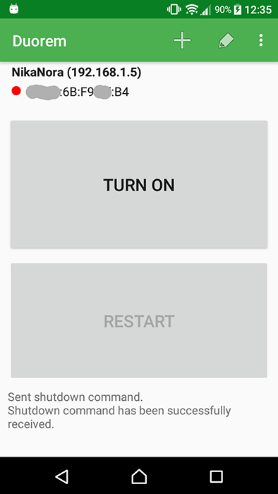

Duorem
======

This is an Android app that allows you to power off and on a remote computer. It appeared because my wife wanted an easy way to control media home computer at home, something not geeky. :)

Wake On Lan (WOL) technology is used to wake up a remote computer. You might need to do additional configuration of your network and remote computer before you can use it. Note also that WOL works reliably if your remote computer is connected to router/Internet via cable, i.e. not WiFi.

In order to power off and reboot a remote computer, a secure shell Linux command (SSH) is used. This means that your remote computer should run some variant of Linux and have SSH server installed. Normally, not a problem with an Ubuntu/Debian. Note that SSH credentials are save via app shared preferences unencrypted. It seems like if your device is rooted and someone wants your password, encryption won't stop them for long. If your device is not rooted, then shared preferences can be OK location for storing your password. Anyway, you have the choice if you afraid. You can stop using the app, or make a pull request.

And finally you might use this app as a tutorial in Android app development. I encountered number of issues which were not covered by Android documentation during the development. For example, there are several tutorials about supporting both phone and tablet layouts via fragments. Yet they do not cover the topic of adding an application bar. By using a naive approach, you will end up with a double application bar on tablets. Here is a list of topics covered by the app:
- App bar implemented via toolbar.
- Fragments with support of different layouts on different devices and app bars.
- RecyclerView and it's adapter.
- Handling connection status; user notification.
- Working with network; network scanning; host polling.
- Async tasks.

Screenshots
-----------

You can find app screenshots in `screenshots` folder. Here is the main screen screen:

Build
-----

- Clone the code
- Open in Android Studio and build. I've used Android Studio 2.3.x.

Acknowledgment
--------------

- Network discovery part of the app is based on [Network Discovery](https://github.com/rorist/android-network-discovery) app.
- [JSch](http://www.jcraft.com/jsch/) is used as a library to work with SSH.
- Japanese translation provided by [naofum](https://github.com/naofum).

Todo
----

- Add RecyclerView list item selection. This might be useful on tablets, when user can see the list and configuration dialog at the same time.
- Theme change via setting or day/night theme activation.
- Widget support. Might be even easier to have two buttons as a widget. However, I constantly poll the target, so it is a potential battery drain.

GPLv3 License
-------

    Copyright (C) 2009-2011 Aubort Jean-Baptiste (Rorist)
    Copyright (C) 2017 Vadim Frolov

    This program is free software: you can redistribute it and/or modify
    it under the terms of the GNU General Public License as published by
    the Free Software Foundation, either version 3 of the License, or
    (at your option) any later version.

    This program is distributed in the hope that it will be useful,
    but WITHOUT ANY WARRANTY; without even the implied warranty of
    MERCHANTABILITY or FITNESS FOR A PARTICULAR PURPOSE.  See the
    GNU General Public License for more details.

    You should have received a copy of the GNU General Public License
    along with this program.  If not, see <http://www.gnu.org/licenses/>.

Copy of the license can be found in gpl-3.0.txt

